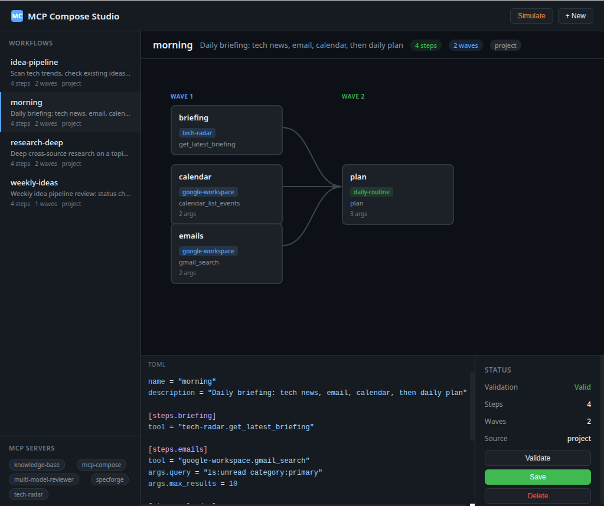

# MCP Compose

Local workflow orchestrator for MCP servers. Define multi-step workflows as TOML files, compose tools from different MCP servers into DAGs with parallel execution and data flow between steps.



## Why

You have multiple MCP servers (tech-radar, specforge, knowledge-base, etc.) each with their own tools. MCP Compose lets you chain them together into reusable workflows — like shell pipes but for MCP tools.

```
tech-radar.get_latest_briefing ──┐
google-workspace.gmail_search ───┤── daily-routine.plan
google-workspace.calendar_list ──┘
```

## Install

```bash
cd ~/Projects/mcp-compose
pip install -e ".[dev]"
```

This gives you the `mc` CLI command and registers the MCP server.

## Quick Start

### 1. Create a workflow

```bash
mc new morning
```

This creates `~/.claude/workflows/morning.toml`. Edit it:

```toml
name = "morning"
description = "Daily briefing: tech news, email, calendar, then daily plan"

[steps.briefing]
tool = "tech-radar.get_latest_briefing"

[steps.emails]
tool = "google-workspace.gmail_search"
args.query = "is:unread category:primary"
args.max_results = 10

[steps.calendar]
tool = "google-workspace.calendar_list_events"
args.time_min = "{{today}}"
args.time_max = "{{tomorrow}}"

[steps.plan]
tool = "daily-routine.plan"
depends_on = ["briefing", "emails", "calendar"]
args.briefing = "{{steps.briefing.output}}"
args.emails = "{{steps.emails.output}}"
args.calendar = "{{steps.calendar.output}}"
```

### 2. Validate it

```bash
mc validate morning
# OK: morning — 4 steps, 2 waves
#   Wave 1: briefing, emails, calendar
#   Wave 2: plan
```

### 3. Run it

**Via Claude Code (recommended):**
> "Run my morning workflow"

Claude Code calls `mcp-compose.run_workflow`, gets the execution plan, then executes each wave's tools in order — passing outputs between steps automatically.

**Via CLI (shows plan):**
```bash
mc run morning
```

## Workflow Format

Workflows are TOML files with a simple structure:

```toml
name = "workflow-name"
description = "What this workflow does"

[steps.step_name]
tool = "server.tool_name"        # Required: MCP server.tool
args.param = "value"             # Optional: tool arguments
depends_on = ["other_step"]      # Optional: run after these steps
```

### Rules

- **tool** must be in `server.tool_name` format (must contain a dot)
- **depends_on** creates ordering — steps without dependencies run in parallel
- No circular dependencies allowed
- At least one step required

### Templates

Use `{{expr}}` in args to reference dynamic values:

| Template | Resolves To |
|----------|-------------|
| `{{today}}` | Today's date (ISO format) |
| `{{tomorrow}}` | Tomorrow's date (ISO format) |
| `{{now}}` | Current datetime (ISO 8601 UTC) |
| `{{steps.X.output}}` | Output from step X |
| `{{topic}}` | Runtime override (pass via `overrides`) |

**Data flow example** — pass one step's output to another:

```toml
[steps.fetch]
tool = "tech-radar.search_radar"
args.query = "rust frameworks"

[steps.analyze]
tool = "multi-model-reviewer.multi_model_review"
args.context = "{{steps.fetch.output}}"
depends_on = ["fetch"]
```

When `{{steps.fetch.output}}` is the entire arg value, the raw type is preserved (dict, list, etc.). When embedded in a string, it's JSON-serialized.

### Runtime Overrides

Pass variables at runtime for parameterized workflows:

```toml
# research-deep.toml
[steps.radar]
tool = "tech-radar.search_radar"
args.query = "{{topic}}"
```

Via Claude Code: "Run research-deep workflow with topic = WebTransport"

The `overrides` parameter in `run_workflow` replaces template variables before execution.

## CLI Reference

| Command | Description |
|---------|-------------|
| `mc list` | List all available workflows |
| `mc validate <name>` | Check TOML syntax and DAG validity |
| `mc run <name>` | Show execution plan |
| `mc new <name>` | Scaffold a new workflow file |
| `mc new <name> --project` | Create in project-local directory |
| `mc studio` | Launch visual workflow builder (port 37790) |

## MCP Server

MCP Compose runs as an MCP server registered in `~/.claude.json`. Claude Code uses these tools:

| Tool | Purpose |
|------|---------|
| `list_workflows` | Browse available workflows |
| `get_workflow` | Get full DAG with waves |
| `validate_workflow` | Check syntax and structure |
| `run_workflow` | Get execution plan for Claude to run |

### How Claude Code Executes Workflows

1. Calls `run_workflow(name)` to get the execution plan
2. Receives waves (groups of parallel steps) with tool names and args
3. Executes each wave's tools in parallel
4. Passes results to the next wave using template mappings
5. Reports final status

## Workflow Discovery

Workflows are discovered from two locations:

| Location | Scope | Created By |
|----------|-------|------------|
| `~/.claude/workflows/*.toml` | Global (all projects) | `mc new <name>` |
| `.claude/workflows/*.toml` | Project-local | `mc new <name> --project` |

Project-local workflows override global ones with the same name.

## DAG Execution Model

Steps are organized into **waves** based on their dependencies:

```
Wave 1: [steps with no dependencies]     <- run in parallel
Wave 2: [steps depending on wave 1]      <- run in parallel
Wave 3: [steps depending on wave 1 or 2] <- run in parallel
```

**Failure handling:**
- Failed step: marked as `failed`
- Steps depending on a failed step: `skipped`
- Independent steps: continue normally

This means a failure in one branch doesn't kill the entire workflow.

## Included Workflows

### morning
Daily briefing combining tech news, email, calendar into a daily plan.
- **Servers:** tech-radar, google-workspace
- **Waves:** 2 (gather in parallel, then plan)

### idea-pipeline
Scan tech trends, check existing idea pipeline, search for new opportunities.
- **Servers:** tech-radar, specforge, knowledge-base
- **Waves:** 2 (gather in parallel, then search knowledge with trend context)

### research-deep
Cross-source deep research on any topic with multi-model synthesis.
- **Servers:** tech-radar, knowledge-base, multi-model-reviewer
- **Waves:** 2 (search 3 sources in parallel, then synthesize)
- **Overrides:** `topic` — the research subject

### weekly-ideas
Weekly review of the idea pipeline — status, ranked list, latest trends, knowledge base health.
- **Servers:** specforge, tech-radar, knowledge-base
- **Waves:** 1 (all independent, run in parallel)

## Writing Good Workflows

1. **Maximize parallelism** — only add `depends_on` when a step truly needs another's output
2. **Use templates for data flow** — `{{steps.X.output}}` passes structured data between steps
3. **Keep steps focused** — one tool call per step, let the DAG handle orchestration
4. **Use overrides for reusability** — `{{topic}}`, `{{query}}` make workflows parameterized
5. **Validate before running** — `mc validate <name>` catches issues early

## Studio — Visual Workflow Builder

MCP Compose includes a built-in visual workflow builder. Launch it with:

```bash
mc studio
```

Opens at `http://127.0.0.1:37790` with:

- **DAG Visualization** — workflows rendered as interactive node graphs with SVG edges and wave labels
- **TOML Editor** — syntax-highlighted editor with live validation (auto-validates on keystroke)
- **Simulation Mode** — step-by-step wave animation showing execution flow
- **MCP Server Discovery** — auto-detects available servers from your Claude config
- **CRUD** — create, edit, validate, save, and delete workflows from the browser

Click any node to inspect its tool, arguments, wave, and dependencies. Ctrl+S to save.

## Architecture

```
src/mcp_compose/
  models.py      Pydantic models, TOML parser, DAG validation
  engine.py      Wave resolver, async executor
  templates.py   {{}} interpolation engine
  config.py      Workflow discovery (global + project)
  cli.py         Typer CLI (mc command)
  mcp_server.py  FastMCP server (4 tools)
  studio.py      Visual workflow builder (FastAPI + embedded UI)
```

## Development

```bash
# Run tests
pytest tests/ -v

# Test coverage
pytest tests/ --cov=mcp_compose --cov-report=term-missing
```

49 tests covering models, engine, templates, config, CLI, MCP server, and async execution.
